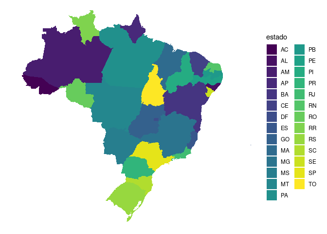

# brhelper

<!-- badges: start -->
<!-- badges: end -->

O pacote brhelper foi criado com objetivo de facilitar a entrada,
conversão e relação de dados geográficos Brasileiros.

## Instalação

Você pode instalar o pacote brhelper do
[GitHub](https://github.com/PauloCampana/brhelper) através de:

``` r
# install.packages("remotes")
remotes::install_github("PauloCampana/brhelper")
# ou
# install.packages("devtools")
devtools::install_github("PauloCampana/brhelper")
```

## Exemplo

Como fazer um mapa usando os dados inbutidos do brhelper e o pacote
[ggplot2](https://ggplot2.tidyverse.org/):

``` r
library(brhelper)
library(tidyverse)

mapa_estado |> 
    ggplot(aes(x = long, y = lat, group = group, fill = id)) +
    geom_polygon() +
    scale_fill_viridis_d() +
    coord_map() +
    theme_void() +
    theme(legend.position = "none")
```


