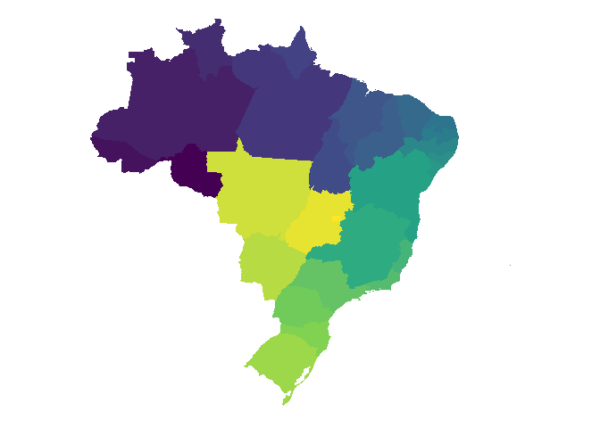

# brhelper

<!-- badges: start -->
<!-- badges: end -->

The goal of brhelper is to …

## Installation

You can install the development version of brhelper from
[GitHub](https://github.com/PauloCampana/brhelper) with:

``` r
# install.packages("devtools")
devtools::install_github("PauloCampana/brhelper")
#> Downloading GitHub repo PauloCampana/brhelper@HEAD
#> * checking for file ‘/tmp/RtmpBaCwfm/remotes483a7db0b95d/PauloCampana-brhelper-df9c24a/DESCRIPTION’ ... OK
#> * preparing ‘brhelper’:
#> * checking DESCRIPTION meta-information ... OK
#> * checking for LF line-endings in source and make files and shell scripts
#> * checking for empty or unneeded directories
#> * building ‘brhelper_0.0.1.tar.gz’
#> Installing package into '/tmp/RtmpnEn8cQ/temp_libpath40d45b6198ef'
#> (as 'lib' is unspecified)
```

## Example

This is a basic example which shows you how to solve a common problem:

``` r
library(brhelper)
library(tidyverse)
#> ── Attaching packages ─────────────────────────────────────── tidyverse 1.3.2 ──
#> ✔ ggplot2 3.4.0      ✔ purrr   0.3.5 
#> ✔ tibble  3.1.8      ✔ dplyr   1.0.10
#> ✔ tidyr   1.2.1      ✔ stringr 1.4.1 
#> ✔ readr   2.1.3      ✔ forcats 0.5.2 
#> ── Conflicts ────────────────────────────────────────── tidyverse_conflicts() ──
#> ✖ dplyr::filter() masks stats::filter()
#> ✖ dplyr::lag()    masks stats::lag()
mapa_estado |> 
    mutate(estado = id |> converter_estado(para = "sigla")) |> 
    ggplot(aes(x = long, y = lat, group = group, fill = estado)) +
    geom_polygon() +
    scale_fill_viridis_d() +
    coord_map() +
    theme_void()
```


